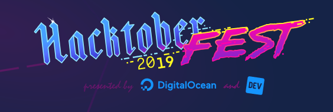
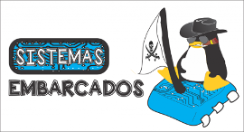

# 
FACOM_Hacktoberfest_2019  

<h4> 1- Create a directory with your favorite language</h4>

 <h4>2- Upload your file </h4>
 
<h5> Files must be a complete program or complete snippet with all dependencies.</h5>

 
<h5> Run your code and test it in an online compiler.</h5>

 
<h3> Review your code, please no wrong logic or mistakes</h3>

 <h4>3- Add your name in contributors</h4>
 <h4>4 - Avoid hello world files, please.</h4>
 <h4>5- Gimme some star :) </h4>

# Happy Hacktoberfest 2019.

<h3>** Sponsors for this repository**</h3>

[Digital Ocean](https://hacktoberfest.digitalocean.com/) && [Sistemas Embarcados](https://www.sistemasembarcados.org)

<h5> Get a great descont for your professional website using Digital Ocean </h5>

[Referral Link](https://m.do.co/c/27808e1e344c)

 

